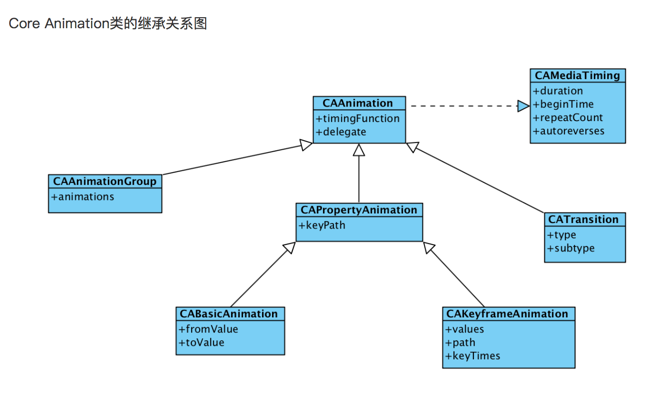
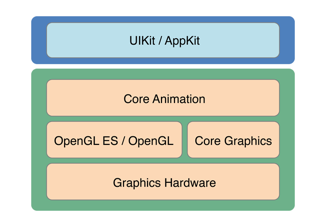

# CoreAnimation

@(iOS)[CoreAnimation]

CoreAnimation是iOS中的动画框架，可以画出各种各样的动画视图。



动画的底层还是绘图，使用的是CoreGraphics来绘图


**layer的属性值**
```
#pragma mark - layer的属性值

- (void)test1 {
    
    //补充：这里的image.scale表示的是图片的比例，跟图片后面的名字 @2x  @3x有关系
    UIImage *image = [UIImage imageNamed:@"5"];
    
    self.mainView.layer.contents = (__bridge id _Nullable)(image.CGImage);
    
    //类似于imageViewMode，这是一个字符串
    self.mainView.layer.contentsGravity = kCAGravityCenter;
    
    //layer层图片的显示比例，如果设置了 contentsGravity = kCAGravityResizeAspect，设置比例则没有任何作用，因为本来就要适应图层的大小，比例没有用处了，如果没有设置了，则表示一个点显示多少个像素点。
    //self.mainView.layer.contentsScale = 4.0f;
    
    //contentsRect属性允许我们在图层边框里显示寄宿图的一个子域，它使用了单位坐标，单位坐标指定在0到1之间，默认的contentsRect是{0, 0, 1, 1}
    //contentsRect经常用来拼合图片，即载入一张大图片，然后分别取大图片的一部分区域来显示，这样比载入多张小图片高效
    //self.mainView.layer.contentsRect = CGRectMake(0.3, 0.3, 0.5, 0.5);
    
    //self.mainView.layer.contentsCenter = CGRectMake(0.5, 0.5, 0.5, 0.5);
    
    //设置阴影的时候，其会将寄宿图（包括子视图，如果有的话）考虑在内，然后通过这些来完美搭配图层形状从而创建一个阴影
    self.mainView.layer.shadowRadius = 10.0f;
    self.mainView.layer.shadowOpacity = 0.6;
    
}
```

**layer画图**
```
#pragma mark - layer画图

- (void)test2 {
    
    //create sublayer
    CALayer *blueLayer = [CALayer layer];
    blueLayer.frame = CGRectMake(50.0f, 50.0f, 100.0f, 100.0f);
    blueLayer.backgroundColor = [UIColor blueColor].CGColor;
    
    //set controller as layer delegate
    blueLayer.delegate = self;
    
    //ensure that layer backing image uses correct scale
    blueLayer.contentsScale = [UIScreen mainScreen].scale; //add layer to our view
    [self.mainView.layer addSublayer:blueLayer];
    
    //一定要加重绘制的操作，不然displayLayer或者drawLayer方法不会调用
    [blueLayer display];
}

- (void)displayLayer:(CALayer *)layer {
    
    
}

- (void)drawLayer:(CALayer *)layer inContext:(CGContextRef)ctx {
    
    //draw a thick red circle
    CGContextSetLineWidth(ctx, 10.0f);
    CGContextSetStrokeColorWithColor(ctx, [UIColor redColor].CGColor);
    CGContextStrokeEllipseInRect(ctx, layer.bounds);
    
}

//当图层的bounds发生改变，或者图层的-setNeedsLayout方法被调用的时候，这个函数将会被执行。
- (void)layoutSublayersOfLayer:(CALayer *)layer {
    
}
```

**用zPosition显示图层的位置**
```
#pragma mark - 用zPosition显示图层的位置

- (void)test3 {
    
    //zPosition属性可以明显改变屏幕上图层的顺序，但不能改变事件传递的顺序。
    CALayer *blueLayer = [CALayer layer];
    blueLayer.frame = CGRectMake(50.0f, 50.0f, 100.0f, 100.0f);
    blueLayer.backgroundColor = [UIColor blueColor].CGColor;
    
    [self.view.layer addSublayer:blueLayer];
    
    CALayer *redLayer = [CALayer layer];
    redLayer.frame = CGRectMake(100.0f, 100.0f, 100.0f, 100.0f);
    redLayer.backgroundColor = [UIColor redColor].CGColor;
    
    [self.view.layer addSublayer:redLayer];
    
    CALayer *orangeLayer = [CALayer layer];
    orangeLayer.frame = CGRectMake(150.0f, 50.0f, 100.0f, 100.0f);
    orangeLayer.backgroundColor = [UIColor orangeColor].CGColor;
    
    [self.view.layer addSublayer:orangeLayer];
    
    blueLayer.zPosition = redLayer.zPosition + 1;
    orangeLayer.zPosition = redLayer.zPosition - 1;
}
```

**图层边框**
```
#pragma mark - 图层边框

- (void)test4 {
    
    //这里可以看到就算红色的视图被遮挡了，其图层边框还是可以看到
    UIView *redView = [[UIView alloc] initWithFrame:CGRectMake(100.0f, 100.0f, 100.0f, 100.0f)];
    redView.layer.backgroundColor = [UIColor redColor].CGColor;
    redView.layer.borderWidth = 2.0f;
    
    [self.view addSubview:redView];
    
    UIView *blueView = [[UIView alloc] initWithFrame:CGRectMake(50.0f, 50.0f, 100.0f, 100.0f)];
    blueView.layer.backgroundColor = [UIColor blueColor].CGColor;
    blueView.layer.borderWidth = 2.0f;
    
    [redView addSubview:blueView];
    
}
```

**使用mask蒙版，展示的是两个图层的重合部分**
```
#pragma mark - 使用mask蒙版，展示的是两个图层的重合部分

- (void)test5 {
    
    UIImageView *imageView = [[UIImageView alloc] initWithFrame:CGRectMake(50, 50, 100, 100)];
    imageView.image = [UIImage imageNamed:@"5"];
    [self.view addSubview:imageView];
    
    //create mask layer
    CALayer *maskLayer = [CALayer layer];
    maskLayer.frame = imageView.bounds;
    UIImage *maskImage = [UIImage imageNamed:@"2.png"];
    maskLayer.contents = (__bridge id)maskImage.CGImage;
    
    //apply mask to image layer
    imageView.layer.mask = maskLayer;
}
```

**组透明**
```
#pragma mark - 组透明

- (UIButton *)customButton
{
    //create button
    CGRect frame = CGRectMake(0, 0, 150, 50);
    UIButton *button = [[UIButton alloc] initWithFrame:frame];
    button.backgroundColor = [UIColor whiteColor];
    button.layer.cornerRadius = 10;
    
    //add label
    frame = CGRectMake(20, 10, 110, 30);
    UILabel *label = [[UILabel alloc] initWithFrame:frame];
    label.text = @"Hello World";
    label.backgroundColor = [UIColor blueColor];
    label.textAlignment = NSTextAlignmentCenter;
    [button addSubview:label];
    label.tag = 2000;
    return button;
}

- (void)test6
{
    UIView *containerView = [[UIView alloc] initWithFrame:self.view.frame];
    containerView.backgroundColor = [UIColor grayColor];
    [self.view addSubview:containerView];
    
    //create opaque button
    UIButton *button1 = [self customButton];
    button1.center = CGPointMake(100, 250);
    button1.alpha = 0.5;
    [containerView addSubview:button1];
    
    //create translucent button
    UIButton *button2 = [self customButton];
    button2.center = CGPointMake(300, 250);
    button2.layer.opacity = 0.5;
    UILabel *label = [button2 viewWithTag:2000];
    label.layer.opacity = 0.5f;
    [containerView addSubview:button2];
    
    //enable rasterization for the translucent button
    button2.layer.shouldRasterize = YES;
    button2.layer.rasterizationScale = [UIScreen mainScreen].scale;
}
```

**变换**
```
#pragma mark - 变换

- (void)test7 {
    
    UIImage *image = [UIImage imageNamed:@"5"];
    
    self.mainView.layer.contents = (__bridge id _Nullable)(image.CGImage);
    
    //本质上是对图层做变换
    
    //缩放
    //self.mainView.transform = CGAffineTransformMakeScale(1.5, 1.5);
    
    //旋转
    //self.mainView.transform = CGAffineTransformMakeRotation(M_2_PI);
    
    //平移
    //self.mainView.transform = CGAffineTransformMakeTranslation(50.0f, 50.0f);
    
    //对应layer的属性为affineTransform
    //self.mainView.layer.affineTransform = CGAffineTransformMakeTranslation(50.0f, 50.0f);
    
    //初始生成一个什么都不做的变换很重要--也就是创建一个CGAffineTransform类型的空值，矩阵论中称作单位矩阵
    //CGAffineTransformIdentity
    
    //变换组合
    CGAffineTransform t1 = CGAffineTransformMakeTranslation(50.0f, 50.0f);
    CGAffineTransform t2 = CGAffineTransformMakeRotation(M_2_PI);
    
    CGAffineTransform t = CGAffineTransformConcat(t1, t2);
    //self.mainView.transform = t;
    
    UIView *tranView = [[UIView alloc] initWithFrame:CGRectMake(50, 50, 100, 100)];
    tranView.layer.contents = (__bridge id _Nullable)(image.CGImage);
    [self.view addSubview:tranView];
    
    CGAffineTransform transform = CGAffineTransformIdentity; //create a new transform
    transform = CGAffineTransformRotate(transform, M_2_PI);
    transform = CGAffineTransformTranslate(transform, 50.0f, 50.0f);
    
    //变换的顺序会影响最终的结果，也就是说旋转之后的平移和平移之后的旋转结果可能不同。
    tranView.transform = transform;
    
    //斜切变换
    CGAffineTransform transform1 = CGAffineTransformIdentity;
    //transform1.c = 1;
    //transform1.b = 1;
    self.mainView.layer.affineTransform = transform1;
    
}
```

**3D变换**
```
#pragma mark - 3D变换

- (void)test8 {
    
    UIImage *image = [UIImage imageNamed:@"5"];
    
    self.mainView.layer.contents = (__bridge id _Nullable)(image.CGImage);
    
    
    //create a new transform
    CATransform3D transform = CATransform3DIdentity;
    
    //m34的默认值是0，我们可以通过设置m34为-1.0 / d来应用透视效果，d代表了想象中视角相机和屏幕之间的距离，以像素为单位
    transform.m34 = - 1.0 / 500.0;
    
    //rotate by 45 degrees along the Y axis
    transform = CATransform3DRotate(transform, M_PI_4, 0, 1, 0);
    
    //apply to layer
    self.mainView.layer.transform = transform;
    
    /** 关于灭点
     
     灭点
     
     当在透视角度绘图的时候，远离相机视角的物体将会变小变远，当远离到一个极限距离，它们可能就缩成了一个点，于是所有的物体最后都汇聚消失在同一个点。
     
     在现实中，这个点通常是视图的中心，于是为了在应用中创建拟真效果的透视，这个点应该聚在屏幕中点，或者至少是包含所有3D对象的视图中点。
     
     Core Animation定义了这个点位于变换图层的anchorPoint（通常位于图层中心，但也有例外，见第三章）。这就是说，当图层发生变换时，这个点永远位于图层变换之前anchorPoint的位置。
     
     当改变一个图层的position，你也改变了它的灭点，做3D变换的时候要时刻记住这一点，当你视图通过调整m34来让它更加有3D效果，应该首先把它放置于屏幕中央，然后通过平移来把它移动到指定位置（而不是直接改变它的position），这样所有的3D图层都共享一个灭点。
     */
}
```

**sublayerTransform属性**
```
#pragma mark - sublayerTransform属性

- (void)test9 {
    
    /** CALayer有一个属性叫做sublayerTransform。它也是CATransform3D类型，但和对一个图层的变换不同，它影响到所有的子图层。这意味着你可以一次性对包含这些图层的容器做变换，于是所有的子图层都自动继承了这个变换方法。
     */
    
    UIImage *image = [UIImage imageNamed:@"5"];
    
    UIView *containerView = [[UIView alloc] initWithFrame:self.view.frame];
    containerView.backgroundColor = [UIColor grayColor];
    [self.view addSubview:containerView];
    
    UIView *leftView = [[UIView alloc] initWithFrame:CGRectMake(50, 50, 100, 100)];
    leftView.layer.contents = (__bridge id _Nullable)(image.CGImage);
    [containerView addSubview:leftView];
    
    UIView *rightView = [[UIView alloc] initWithFrame:CGRectMake(200, 50, 100, 100)];
    rightView.layer.contents = (__bridge id _Nullable)(image.CGImage);
    [containerView addSubview:rightView];
    
    
    //apply perspective transform to container
    CATransform3D perspective = CATransform3DIdentity;
    perspective.m34 = - 1.0 / 800.0;
    containerView.layer.sublayerTransform = perspective;
    
    //rotate layerView1 by 45 degrees along the Y axis
    CATransform3D transform1 = CATransform3DMakeRotation(M_PI_4, 0, 1, 0);
    leftView.layer.transform = transform1;
    
    //rotate layerView2 by 45 degrees along the Y axis
    CATransform3D transform2 = CATransform3DMakeRotation(-M_PI_4, 0, 1, 0);
    rightView.layer.transform = transform2;
}


/** 背面
 
 CALayer有一个叫做doubleSided的属性来控制图层的背面是否要被绘制。这是一个BOOL类型，默认为YES，如果设置为NO，那么当图层正面从相机视角消失的时候，它将不会被绘制。
 */
```

**CAShapeLayer图层**
```
#pragma mark - CAShapeLayer图层

- (void)test10 {
    
    /** CAShapeLayer是一个通过矢量图形而不是bitmap来绘制的图层子类。
     CATextLayer是Core Animation提供了一个CALayer的子类CATextLayer，它以图层的形式包含了UILabel几乎所有的绘制特性，并且额外提供了一些新的特性。
     
     CATransformLayer图层
     */
    
    //create a text layer
    CATextLayer *textLayer = [CATextLayer layer];
    textLayer.frame = self.mainView.bounds;
    [self.mainView.layer addSublayer:textLayer];
    
    //set text attributes
    textLayer.foregroundColor = [UIColor blackColor].CGColor;
    textLayer.alignmentMode = kCAAlignmentJustified;
    textLayer.wrapped = YES;
    
    //决定图层内容应该以怎样的分辨率来渲染，不然会像素化
    textLayer.contentsScale = [UIScreen mainScreen].scale;
    
    //choose a font
    UIFont *font = [UIFont systemFontOfSize:15];
    
    //set layer font
    CFStringRef fontName = (__bridge CFStringRef)font.fontName;
    CGFontRef fontRef = CGFontCreateWithFontName(fontName);
    textLayer.font = fontRef;
    textLayer.fontSize = font.pointSize;
    CGFontRelease(fontRef);
    
    //choose some text
    NSString *text = @"Lorem ipsum";
    
    //set layer text
    textLayer.string = text;
    
}
```

**CAGradientLayer图层**
```
#pragma mark - CAGradientLayer图层

- (void)test11 {
    
    /** CAGradientLayer是用来生成两种或更多颜色平滑渐变的。用Core Graphics复制一个CAGradientLayer并将内容绘制到一个普通图层的寄宿图也是有可能的，但是CAGradientLayer的真正好处在于绘制使用了硬件加速。 */
    
    //create gradient layer and add it to our container view
    CAGradientLayer *gradientLayer = [CAGradientLayer layer];
    gradientLayer.frame = self.mainView.bounds;
    [self.mainView.layer addSublayer:gradientLayer];
    
    //这些渐变色彩放在一个数组中，并赋给colors属性。这个数组成员接受CGColorRef类型的值（并不是从NSObject派生而来），所以我们要用通过bridge转换以确保编译正常
    gradientLayer.colors = @[(__bridge id)[UIColor redColor].CGColor, (__bridge id) [UIColor yellowColor].CGColor, (__bridge id)[UIColor greenColor].CGColor];
    
    //但是我们可以用locations属性来调整空间。locations属性是一个浮点数值的数组（以NSNumber包装）。这些浮点数定义了colors属性中每个不同颜色的位置，同样的，也是以单位坐标系进行标定。0.0代表着渐变的开始，1.0代表着结束。
    gradientLayer.locations = @[@0.0, @0.25, @0.5];
    
    //startPoint和endPoint属性，他们决定了渐变的方向。这两个参数是以单位坐标系进行的定义，所以左上角坐标是{0, 0}，右下角坐标是{1, 1}。
    gradientLayer.startPoint = CGPointMake(0, 0);
    gradientLayer.endPoint = CGPointMake(1, 1);
    
}
```

**CAReplicatorLayer图层**
```
#pragma mark - CAReplicatorLayer图层

- (void)test12 {
    
    /** CAReplicatorLayer的目的是为了高效生成许多相似的图层。它会绘制一个或多个图层的子图层，并在每个复制体上应用不同的变换。看上去演示能够更加解释这些，我们来写个例子吧。 */
    
    //instanceTransform指定了一个CATransform3D3D变换（这种情况下，下一图层的位移和旋转将会移动到圆圈的下一个点）。
    
    //create a replicator layer and add it to our view
    CAReplicatorLayer *replicator = [CAReplicatorLayer layer];
    replicator.frame = self.mainView.bounds;
    [self.view.layer addSublayer:replicator];
    //instanceCount属性指定了图层需要重复多少次。
    replicator.instanceCount = 10;
    
    //instanceTransform指定了一个CATransform3D3D变换（这种情况下，下一图层的位移和旋转将会移动到圆圈的下一个点）。
    CATransform3D transform = CATransform3DIdentity;
    transform = CATransform3DTranslate(transform, 0, 20, 0);
    //    transform = CATransform3DRotate(transform, M_PI / 5.0, 0, 0, 1);
    //    transform = CATransform3DTranslate(transform, 0, -20, 0);
    replicator.instanceTransform = transform;
    
    //这是用instanceBlueOffset和instanceGreenOffset属性实现的。通过逐步减少蓝色和绿色通道，我们逐渐将图层颜色转换成了红色。
    replicator.instanceBlueOffset = -0.1;
    replicator.instanceGreenOffset = -0.1;
    
    //起始位置的layer
    CALayer *layer = [CALayer layer];
    layer.frame = CGRectMake(100.0f, 100.0f, 100.0f, 100.0f);
    layer.backgroundColor = [UIColor yellowColor].CGColor;
    [replicator addSublayer:layer];
    
}

```
**CAEmitterLayer图层**
```
#pragma mark - CAEmitterLayer图层

- (void)test13 {
    
    /** CAEmitterLayer是一个高性能的粒子引擎 */
    
    //create particle emitter layer
    CAEmitterLayer *emitter = [CAEmitterLayer layer];
    emitter.frame = self.mainView.bounds;
    [self.mainView.layer addSublayer:emitter];
    
    //configure emitter
    emitter.renderMode = kCAEmitterLayerAdditive;
    emitter.emitterPosition = CGPointMake(emitter.frame.size.width / 2.0, emitter.frame.size.height / 2.0);
    
    //create a particle template
    CAEmitterCell *cell = [[CAEmitterCell alloc] init];
    cell.contents = (__bridge id)[UIImage imageNamed:@"2.png"].CGImage;
    cell.birthRate = 150;
    cell.lifetime = 5.0;
    cell.color = [UIColor colorWithRed:1 green:0.5 blue:0.1 alpha:1.0].CGColor;
    cell.alphaSpeed = -0.4;
    cell.velocity = 50;
    cell.velocityRange = 50;
    cell.emissionRange = M_PI * 2.0;
    
    //add particle template to emitter
    emitter.emitterCells = @[cell];
}
```
**CATransaction动画**
```
#pragma mark - CATransaction动画

- (void)test14 {
    
    //otherwise (slowly) move the layer to new position
    [CATransaction begin];
    [CATransaction setAnimationDuration:4.0];
    self.mainView.layer.position = CGPointMake(400, 400);
    [CATransaction commit];
}
```

**CABasicAnimation**
```
#pragma mark - CABasicAnimation

- (void)test15
{
    /** 这是因为动画并没有改变图层的模型，而只是呈现（第七章）。一旦动画结束并从图层上移除之后，图层就立刻恢复到之前定义的外观状态。我们从没改变过backgroundColor属性，所以图层就返回到原始的颜色。
     
     当之前在使用隐式动画的时候，实际上它就是用例子中CABasicAnimation来实现的（回忆第七章，我们在-actionForLayer:forKey:委托方法打印出来的结果就是CABasicAnimation）。但是在那个例子中，我们通过设置属性来打开动画。在这里我们做了相同的动画，但是并没有设置任何属性的值（这就是为什么会立刻变回初始状态的原因）。
     
     这里有两个方法来更新动画结束后的属性状态
     1、在动画之前设置动画结束后的属性值
     2、使用CAAnimationDelegate设置动画结束后的值-animationDidStop:finished:
     */
    
    //create a new random color
    CGFloat red = arc4random() / (CGFloat)INT_MAX;
    CGFloat green = arc4random() / (CGFloat)INT_MAX;
    CGFloat blue = arc4random() / (CGFloat)INT_MAX;
    UIColor *color = [UIColor colorWithRed:red green:green blue:blue alpha:1.0];
    //create a basic animation
    CABasicAnimation *animation = [CABasicAnimation animation];
    animation.keyPath = @"backgroundColor";
    animation.toValue = (__bridge id)color.CGColor;
    animation.duration = 2.0f;
    animation.delegate = self;
    //apply animation to layer
    [self.mainView.layer addAnimation:animation forKey:nil];
    
}

//- (void)animationDidStop:(CAAnimation *)anim finished:(BOOL)flag {
//    
//    //委托传入的动画参数是原始值的一个深拷贝，从而不是同一个值。这里的ani是原始动画的深拷贝
//    
//}

```

**CAKeyframeAnimation**
```
#pragma mark - CAKeyframeAnimation

- (void)test16 {
    
    //create a path
    UIBezierPath *bezierPath = [[UIBezierPath alloc] init];
    [bezierPath moveToPoint:CGPointMake(0, 150)];
    [bezierPath addCurveToPoint:CGPointMake(300, 150) controlPoint1:CGPointMake(75, 0) controlPoint2:CGPointMake(225, 300)];
    //draw the path using a CAShapeLayer
    CAShapeLayer *pathLayer = [CAShapeLayer layer];
    pathLayer.path = bezierPath.CGPath;
    pathLayer.fillColor = [UIColor clearColor].CGColor;
    pathLayer.strokeColor = [UIColor redColor].CGColor;
    pathLayer.lineWidth = 3.0f;
    [self.mainView.layer addSublayer:pathLayer];
    //add the ship
    CALayer *shipLayer = [CALayer layer];
    shipLayer.frame = CGRectMake(0, 0, 64, 64);
    shipLayer.position = CGPointMake(0, 150);
    shipLayer.contents = (__bridge id)[UIImage imageNamed: @"2.png"].CGImage;
    [self.mainView.layer addSublayer:shipLayer];
    //create the keyframe animation
    CAKeyframeAnimation *animation = [CAKeyframeAnimation animation];
    animation.keyPath = @"position";
    animation.duration = 4.0;
    animation.path = bezierPath.CGPath;
    
    //设置它为常量kCAAnimationRotateAuto，图层将会根据曲线的切线自动旋转
    animation.rotationMode = kCAAnimationRotateAuto;
    [shipLayer addAnimation:animation forKey:nil];
}
```
**CATransition过渡动画**
```
#pragma mark - CATransition过渡动画

- (void)test17 {
    
    /** 你可以从代码中看出，过渡动画和之前的属性动画或者动画组添加到图层上的方式一致，都是通过-addAnimation:forKey:方法。但是和属性动画不同的是，对指定的图层一次只能使用一次CATransition，因此，无论你对动画的键设置什么值，过渡动画都会对它的键设置成“transition”，也就是常量kCATransition。 */
    
    UIImage *image = [UIImage imageNamed:@"5"];
    self.mainView.layer.contents = (__bridge id _Nullable)(image.CGImage);
    
    dispatch_after(dispatch_time(DISPATCH_TIME_NOW, (int64_t)(2.0f * NSEC_PER_SEC)), dispatch_get_main_queue(), ^{
        
        CATransition *transition = [CATransition animation];
        transition.type = kCATransitionFade;
        transition.duration = 2.0f;
        UIImage *image1 = [UIImage imageNamed:@"2"];
        self.mainView.layer.contents = (__bridge id _Nullable)(image1.CGImage);
        [self.mainView.layer addAnimation:transition forKey:nil];
        
    });
    
}
```

**动画结束后模型树的值并没有改变，layer的属性值并没有改变**
```
#pragma mark - 动画结束后模型树的值并没有改变，layer的属性值并没有改变

- (void)test18 {
    
    
    CABasicAnimation *animation = [CABasicAnimation animation];
    animation.keyPath = @"position";
    animation.toValue = [NSValue valueWithCGPoint:CGPointMake(300, 300)];
    animation.duration = 2.0f;
    animation.delegate = self;
    
    //如果fillMode=kCAFillModeForwards和removedOnComletion=NO，那么在动画执行完毕后，图层会保持显示动画执行后的状态。但在实质上，图层的属性值还是动画执行前的初始值，并没有真正被改变。
    animation.removedOnCompletion = NO;
    animation.fillMode = kCAFillModeForwards;
    
    [self.mainView.layer addAnimation:animation forKey:nil];
}
```

**timeOffset使用**
```
#pragma mark - timeOffset使用

- (void)test19 {
    
    /** timeOffset一个很有用的功能在于你可以它可以让你手动控制动画进程，通过设置speed为0，可以禁用动画的自动播放，然后来使用timeOffset来来回显示动画序列。这可以使得运用手势来手动控制动画变得很简单。
     
     举个简单的例子：还是之前关门的动画，修改代码来用手势控制动画。我们给视图添加一个UIPanGestureRecognizer，然后用timeOffset左右摇晃。
     
     因为在动画添加到图层之后不能再做修改了，我们来通过调整layer的timeOffset达到同样的效果（清单9.4）。
     */
    
    //add the door
    self.doorLayer = [CALayer layer];
    self.doorLayer.frame = CGRectMake(0, 0, 128, 256);
    self.doorLayer.position = CGPointMake(150 - 64, 150);
    self.doorLayer.anchorPoint = CGPointMake(0, 0.5);
    self.doorLayer.contents = (__bridge id)[UIImage imageNamed:@"5"].CGImage;
    [self.view.layer addSublayer:self.doorLayer];
    //apply perspective transform
    CATransform3D perspective = CATransform3DIdentity;
    perspective.m34 = -1.0 / 500.0;
    self.mainView.layer.sublayerTransform = perspective;
    //add pan gesture recognizer to handle swipes
    UIPanGestureRecognizer *pan = [[UIPanGestureRecognizer alloc] init];
    [pan addTarget:self action:@selector(pan:)];
    [self.view addGestureRecognizer:pan];
    //pause all layer animations
    self.doorLayer.speed = 0.0;
    //apply swinging animation (which won't play because layer is paused)
    CABasicAnimation *animation = [CABasicAnimation animation];
    animation.keyPath = @"transform.rotation.y";
    animation.toValue = @(-M_PI_2);
    animation.duration = 1.0;
    [self.doorLayer addAnimation:animation forKey:nil];
}

- (void)pan:(UIPanGestureRecognizer *)pan
{
    //get horizontal component of pan gesture
    CGFloat x = [pan translationInView:self.view].x;
    //convert from points to animation duration //using a reasonable scale factor
    x /= 200.0f;
    //update timeOffset and clamp result
    CFTimeInterval timeOffset = self.doorLayer.timeOffset;
    timeOffset = MIN(0.999, MAX(0.0, timeOffset - x));
    self.doorLayer.timeOffset = timeOffset;
    //reset pan gesture
    [pan setTranslation:CGPointZero inView:self.view];
}
```

**CAMediaTimingFunction**
```
#pragma mark - CAMediaTimingFunction

- (void)test20 {
    
    CABasicAnimation *animation = [CABasicAnimation animation];
    animation.keyPath = @"position";
    animation.toValue = [NSValue valueWithCGPoint:CGPointMake(300, 300)];
    animation.duration = 2.0f;
    animation.delegate = self;
    
    //设置动画缓冲函数
    animation.timingFunction = [CAMediaTimingFunction functionWithName:kCAMediaTimingFunctionEaseOut];
    
    //如果fillMode=kCAFillModeForwards和removedOnComletion=NO，那么在动画执行完毕后，图层会保持显示动画执行后的状态。但在实质上，图层的属性值还是动画执行前的初始值，并没有真正被改变。
    animation.removedOnCompletion = NO;
    animation.fillMode = kCAFillModeForwards;
    
    [self.mainView.layer addAnimation:animation forKey:nil];
}
```

**子视图和父视图的图层关系**

在这里打印view的layer的子图层，可以看到view1的图层也被加入到了view的根图层中，当一个视图加入到一个父视图中，子视图关联的图层也会加入到父视图关联的图层中（即根图层），形成图层的树状结构，当子视图移除的时候，其图层也会从父视图图层中移除，从而从树状的图层结果中移除。
```
#pragma mark - 子视图和父视图的图层关系
- (void)test0 {
    
    UIView *view1 = [[UIView alloc] initWithFrame:CGRectMake(0, 0, 10, 10)];
    view1.backgroundColor = [UIColor yellowColor];
    [self.mainView addSubview:view1];
    
    NSLog(@"~~~~~%@", self.mainView.layer.sublayers);
    
}
```

**动画并不会修改layer图层本身的变化**

前面说过图层动画的本质就是将图层内部的内容转化为位图经硬件操作形成一种动画效果，其实图层本身并没有任何的变化。上面的动画中图层并没有因为动画效果而改变它的位置（对于缩放动画其大小也是不会改变的），所以动画完成之后图层还是在原来的显示位置没有任何变化，如果一个图层在一个UIView中，当这个UIView在移动过程中如果你要触发UIView的点击事件也只能点击原来的位置（即使它已经运动到了别的位置），因为它的位置从来没有变过。当然解决这个问题方法比较多，这里不妨在动画完成之后重新设置它的位置。比如下面的例子中，当你点击范围超过(0, 0, 300, 300)时则不会响应UIView的tap事件，而要在这个范围才会响应打印UIView的frame和layer的一些属性，而这些属性值并没有改变。
```
#pragma mark - 动画并不会修改layer图层本身的变化

- (void)test01 {
    
    UITapGestureRecognizer *tapGes = [[UITapGestureRecognizer alloc] init
                                      ];
    [tapGes addTarget:self action:@selector(tapClick)];
    
    [self.mainView addGestureRecognizer:tapGes];
    
    
    
    //1.创建动画并指定动画属性
    
    
    CABasicAnimation *basicAnimation=[CABasicAnimation animationWithKeyPath:@"position"
                                      ];
    
    
    //2.设置动画属性初始值和结束值
    
    
    //basicAnimation.fromValue=[NSNumber numberWithInteger:50];//可以不设置，默认为图层初始状态
    
    basicAnimation.toValue=[NSValue valueWithCGPoint:CGPointMake(150.0f, 400.0f)];
    
    
    //设置其他动画属性
    
    basicAnimation.duration=5.0;//动画时间5秒
    
    
    //basicAnimation.repeatCount=HUGE_VALF;//设置重复次数,HUGE_VALF可看做无穷大，起到循环动画的效果
    
    
    //basicAnimation.removedOnCompletion=NO;//运行一次是否移除动画
    
    
    
    
    //3.添加动画到图层，注意key相当于给动画进行命名，以后获得该动画时可以使用此名称获取
    
    [self.mainView.layer addAnimation:basicAnimation forKey:@"KCBasicAnimation_Translation"];
    
}

- (void)tapClick {
    
    NSLog(@"~~~~~~~~~~~%@~~~~%@~~~~%@", NSStringFromCGRect(self.mainView.frame), NSStringFromCGRect(self.mainView.layer.bounds), NSStringFromCGPoint(self.mainView.layer.anchorPoint));
    
}

```

**移动动画，关闭隐式动画**

这里有个问题，每次点击的动画都是从图层最开始的原来的位置position为(50, 150)的地方开始的，因为动画的时候并没有改变图层的状态，所以当一个新的动画过程来的时候，初始位置还是图层最开始(50, 150)的位置。

```
#pragma mark - 移动动画，关闭隐式动画

- (void)test02 {
    
    //自定义一个图层
    
    
    self.layer = [[CALayer alloc] init];
    
    self.layer.bounds = CGRectMake(0, 0, 10, 10);
    
    self.layer.position = CGPointMake(50, 150);
    
    self.layer.backgroundColor = [UIColor redColor].CGColor;
    
    [self.view.layer addSublayer:self.layer];
}

//移动动画
-(void)translatonAnimation:(CGPoint)location{


    //1.创建动画并指定动画属性


    CABasicAnimation *basicAnimation=[CABasicAnimation animationWithKeyPath:@"position"];


    //2.设置动画属性初始值和结束值


    //basicAnimation.fromValue=[NSNumber numberWithInteger:50];//可以不设置，默认为图层初始状态

    basicAnimation.toValue=[NSValue valueWithCGPoint:location];


    //设置其他动画属性

    basicAnimation.duration=5.0;//动画时间5秒


    //basicAnimation.repeatCount=HUGE_VALF;//设置重复次数,HUGE_VALF可看做无穷大，起到循环动画的效果


    //basicAnimation.removedOnCompletion=NO;//运行一次结束后是否移除动画


    basicAnimation.delegate=self;


    //存储当前位置在动画结束后使用

    [basicAnimation setValue:[NSValue valueWithCGPoint:location] forKey:@"KCBasicAnimationLocation"];


    //如果fillMode=kCAFillModeForwards和removedOnComletion=NO，那么在动画执行完毕后，图层会保持显示动画执行后的状态。但在实质上，图层的属性值还是动画执行前的初始值，并没有真正被改变。


    //basicAnimation.fillMode = kCAFillModeForwards;


    //basicAnimation.removedOnCompletion = NO;


    //3.添加动画到图层，注意key相当于给动画进行命名，以后获得该动画时可以使用此名称获取

    [_layer addAnimation:basicAnimation forKey:@"KCBasicAnimation_Translation"];
}

//点击事件
-(void)touchesBegan:(NSSet *)touches withEvent:(UIEvent*)event{


    UITouch *touch=touches.anyObject;


    CGPoint location= [touch locationInView:self.view];


    //创建并开始动画

    [self translatonAnimation:location];
}


//动画开始
-(void)animationDidStart:(CAAnimation*)anim{


    NSLog(@"animation(%@) start.\r_layer.frame=%@",anim,NSStringFromCGRect(_layer.frame));


    NSLog(@"%@",[_layer animationForKey:@"KCBasicAnimation_Translation"]);//通过前面的设置的key获得动画

}

/**
 
 如果运行上面的代码大家可能会发现另外一个问题，那就是动画运行完成后会重新从起始点运动到终点。这个问题产生的原因就是前面提到的，对于非根图层，设置图层的可动画属性（在动画结束后重新设置了position，而position是可动画属性）会产生动画效果。解决这个问题有两种办法：关闭图层隐式动画、设置动画图层为根图层。显然这里不能采取后者。
 
 */


//动画结束
-(void)animationDidStop:(CAAnimation *)anim finished:(BOOL)flag{

    NSLog(@"animation(%@) stop.\r_layer.frame=%@",anim,NSStringFromCGRect(_layer.frame));

    self.layer.position=[[anim valueForKey:@"KCBasicAnimationLocation"] CGPointValue];
}

//使用动画事务CATransaction将隐式动画关闭，动画结束
- (void)animationDidStop:(CAAnimation *)anim finished:(BOOL)flag{

    NSLog(@"animation(%@) stop.\r_layer.frame=%@",anim,NSStringFromCGRect(_layer.frame));

    //开启事务

    [CATransaction begin];

    //禁用隐式动画

    [CATransaction setDisableActions:YES];


    _layer.position=[[anim valueForKey:@"KCBasicAnimationLocation"] CGPointValue];


    //提交事务

    [CATransaction commit];
}
```

**根据锚点进行旋转**

```
#pragma mark - 根据锚点进行旋转

- (void)test03 {
    
    //自定义一个图层
    
    self.layer = [[CALayer alloc] init];
    
    self.layer.bounds = CGRectMake(0, 0, 100, 50);
    
    self.layer.position = CGPointMake(50, 150);
    
    self.layer.anchorPoint=CGPointMake(0.8, 0.5);//设置锚点
    
    self.layer.backgroundColor = [UIColor redColor].CGColor;
    
    [self.view.layer addSublayer:self.layer];
}

//旋转动画
-(void)rotationAnimation{


    //在这里需要强调一下，图层的形变都是基于锚点进行的。例如旋转，旋转的中心点就是图层的锚点。在这里我们以锚点为(0.8, 0.5)进行旋转

    //1.创建动画并指定动画属性


    CABasicAnimation *basicAnimation=[CABasicAnimation animationWithKeyPath:@"transform.rotation.z"];

    //2.设置动画属性初始值、结束值


    //basicAnimation.fromValue=[NSNumber numberWithInt:M_PI_2];

    basicAnimation.toValue=[NSNumber numberWithFloat:M_PI_2*3];


    //设置其他动画属性

    basicAnimation.duration=6.0;

    basicAnimation.autoreverses=true;//旋转后再旋转到原来的位置


    //4.添加动画到图层，注意key相当于给动画进行命名，以后获得该动画时可以使用此名称获取

    [_layer addAnimation:basicAnimation forKey:@"KCBasicAnimation_Rotation"];
}

//点击事件
-(void)touchesBegan:(NSSet *)touches withEvent:(UIEvent*)event{


    UITouch *touch=touches.anyObject;


    CGPoint location= [touch locationInView:self.view];


    //旋转动画

    [self rotationAnimation];
}
```

**动画的暂停和恢复**

动画暂停针对的是图层而不是图层中的某个动画。
要做无限循环的动画，动画的removedOnCompletion属性必须设置为NO，否则运行一次动画就会销毁。

核心动画的运行有一个媒体时间的概念，假设将一个旋转动画设置旋转一周用时60秒的话，那么当动画旋转90度后媒体时间就是15秒。如果此时要将动画暂停只需要让媒体时间偏移量设置为15秒即可，并把动画运行速度设置为0使其停止运动。类似的，如果又过了60秒后需要恢复动画（此时媒体时间为75秒），这时只要将动画开始开始时间设置为当前媒体时间75秒减去暂停时的时间（也就是之前定格动画时的偏移量）15秒（开始时间=75-15=60秒），那么动画就会重新计算60秒后的状态再开始运行，与此同时将偏移量重新设置为0并且把运行速度设置1。这个过程中真正起到暂停动画和恢复动画的其实是动画速度的调整，媒体时间偏移量以及恢复时的开始时间设置主要为了让动画更加连贯。
 

```
#pragma mark - 动画的暂停和恢复

- (void)test04 {
    
    //自定义一个图层
    
    self.layer = [[CALayer alloc] init];
    
    self.layer.bounds = CGRectMake(0, 0, 100, 50);
    
    self.layer.position = CGPointMake(50, 150);
    
    self.layer.anchorPoint=CGPointMake(0.8, 0.5);//设置锚点
    
    
    self.layer.backgroundColor = [UIColor redColor].CGColor;
    
    [self.view.layer addSublayer:self.layer];
}

//移动动画
-(void)translatonAnimation:(CGPoint)location{


    //1.创建动画并指定动画属性


    CABasicAnimation *basicAnimation=[CABasicAnimation animationWithKeyPath:@"position"];


    //2.设置动画属性初始值和结束值


    //basicAnimation.fromValue=[NSNumber numberWithInteger:50];//可以不设置，默认为图层初始状态

    basicAnimation.toValue=[NSValue valueWithCGPoint:location];


    //设置其他动画属性

    basicAnimation.duration=5.0;//动画时间5秒


    //basicAnimation.repeatCount=HUGE_VALF;//设置重复次数,HUGE_VALF可看做无穷大，起到循环动画的效果

    basicAnimation.removedOnCompletion=NO;//运行一次结束后是否移除动画


    basicAnimation.delegate=self;


    //存储当前位置在动画结束后使用

    [basicAnimation setValue:[NSValue valueWithCGPoint:location] forKey:@"KCBasicAnimationLocation"];


    //如果fillMode=kCAFillModeForwards和removedOnComletion=NO，那么在动画执行完毕后，图层会保持显示动画执行后的状态。但在实质上，图层的属性值还是动画执行前的初始值，并没有真正被改变。


    //basicAnimation.fillMode = kCAFillModeForwards;


    //basicAnimation.removedOnCompletion = NO;


    //3.添加动画到图层，注意key相当于给动画进行命名，以后获得该动画时可以使用此名称获取

    [_layer addAnimation:basicAnimation forKey:@"KCBasicAnimation_Translation"];
}

//旋转动画
-(void)rotationAnimation{
    
    
    //1.创建动画并指定动画属性
    
    
    CABasicAnimation *basicAnimation=[CABasicAnimation animationWithKeyPath:@"transform.rotation.z"
                                      ];
    
    
    //2.设置动画属性初始值、结束值
    
    
    //basicAnimation.fromValue=[NSNumber numberWithInt:M_PI_2];
    
    basicAnimation.toValue=[NSNumber numberWithFloat:M_PI_2*3];
    
    
    //设置其他动画属性
    
    basicAnimation.duration=6.0;
    
    basicAnimation.autoreverses=true;//旋转后在旋转到原来的位置
    
    basicAnimation.repeatCount=HUGE_VALF;//设置无限循环
    
    basicAnimation.removedOnCompletion=NO;
    
    //basicAnimation.delegate=self;
    
    
    //4.添加动画到图层，注意key相当于给动画进行命名，以后获得该动画时可以使用此名称获取
    
    [_layer addAnimation:basicAnimation forKey:@"KCBasicAnimation_Rotation"];
}

//点击事件
-(void)touchesBegan:(NSSet *)touches withEvent:(UIEvent*)event{
    
    UITouch *touch=touches.anyObject;
    
    CGPoint location= [touch locationInView:self.view];
    
    //判断是否已经常见过动画，如果已经创建则不再创建动画
    
    
    CAAnimation *animation= [_layer animationForKey:@"KCBasicAnimation_Translation"];
    
    if(animation){
        
        if (_layer.speed==0) {
            [self animationResume];
        }
        else
        {
            [self animationPause];
        }
    }
    else
    {
        
        //创建并开始动画
        
        [self translatonAnimation:location];
        
        [self rotationAnimation];
    }
}

//动画暂停
-(void)animationPause{
    
    //取得指定图层动画的媒体时间，后面参数用于指定子图层，这里不需要
    
    
    CFTimeInterval interval=[_layer convertTime:CACurrentMediaTime() fromLayer:nil];
    
    //设置时间偏移量，保证暂停时停留在旋转的位置
    
    [_layer setTimeOffset:interval];
    
    //速度设置为0，暂停动画
    
    
    _layer.speed=0;
}

//动画恢复
-(void)animationResume{
    
    //获得暂停的时间
    
    
    CFTimeInterval beginTime= CACurrentMediaTime()- _layer.timeOffset;
    
    //设置偏移量
    
    
    _layer.timeOffset=0;
    
    //设置开始时间
    
    
    _layer.beginTime=beginTime;
    
    //设置动画速度，开始运动
    
    
    _layer.speed=1.0;
}


//动画开始
-(void)animationDidStart:(CAAnimation*)anim{
    
    
    NSLog(@"animation(%@) start.\r_layer.frame=%@",anim,NSStringFromCGRect(_layer.frame));
    
    NSLog(@"%@",[_layer animationForKey:@"KCBasicAnimation_Translation"]);//通过前面的设置的key获得动画
    
}

//动画结束
-(void)animationDidStop:(CAAnimation *)anim finished:(BOOL)flag{
    
    NSLog(@"animation(%@) stop.\r_layer.frame=%@",anim,NSStringFromCGRect(_layer.frame));
    
    //开启事务
    
    [CATransaction begin];
    
    //禁用隐式动画
    
    [CATransaction setDisableActions:YES];
    
    
    _layer.position=[[anim valueForKey:@"KCBasicAnimationLocation"] CGPointValue];
    
    
    //提交事务
    
    [CATransaction commit];
    
    
    //暂停动画
    
    [self animationPause];
    
}
```

**关键帧动画**

关键帧动画就是在动画控制过程中开发者指定主要的动画状态，至于各个状态间动画如何进行则由系统自动运算补充（每两个关键帧之间系统形成的动画称为“补间动画”），这种动画的好处就是开发者不用逐个控制每个动画帧，而只要关心几个关键帧的状态即可。

关键帧动画开发分为两种形式：一种是通过设置不同的属性值进行关键帧控制，另一种是通过绘制路径进行关键帧控制。后者优先级高于前者，如果设置了路径则属性值就不再起作用。

```
#pragma mark - 关键帧动画

//移动动画
-(void)translatonAnimation:(CGPoint)location{
    
    //1.创建关键帧动画并设置动画属性
    
    CAKeyframeAnimation *keyframeAnimation=[CAKeyframeAnimation animationWithKeyPath:@"position"];
    
    //2.设置关键帧,这里有四个关键帧
    
    NSValue *key1=[NSValue valueWithCGPoint:_layer.position];//对于关键帧动画初始值不能省略
    
    NSValue *key2=[NSValue valueWithCGPoint:CGPointMake(80, 220)];
    
    NSValue *key3=[NSValue valueWithCGPoint:CGPointMake(45, 300)];
    
    NSValue *key4=[NSValue valueWithCGPoint:CGPointMake(55, 400)];
    
    NSArray *values=@[key1,key2,key3,key4];
    
    keyframeAnimation.values=values;
    
    //设置其他属性
    
    keyframeAnimation.duration=8.0;keyframeAnimation.
    beginTime=CACurrentMediaTime()+2;//设置延迟2秒执行
    
    //3.添加动画到图层，添加动画后就会执行动画
    
    [_layer addAnimation:keyframeAnimation forKey:@"KCKeyframeAnimation_Position"];
}

/**
 
 对于路径类型的关键帧动画系统是从描绘路径的位置开始路径，直到路径结束。如果上面的路径不是贝塞尔曲线而是矩形路径那么它会从矩形的左上角开始运行，顺时针一周回到左上角；如果指定的路径是一个椭圆，那么动画运行的路径是从椭圆右侧开始（0度）顺时针一周回到右侧。
 
 */
//关键帧动画
-(void)translationAnimation{
    
    //1.创建关键帧动画并设置动画属性
    
    
    CAKeyframeAnimation *keyframeAnimation=[CAKeyframeAnimation animationWithKeyPath:@"position"
                                            ];
    
    
    //2.设置路径
    
    
    //绘制贝塞尔曲线
    
    
    CGMutablePathRef path=CGPathCreateMutable();
    
    CGPathMoveToPoint(path, NULL, _layer.position.x, _layer.position.y);//移动到起始点
    
    
    CGPathAddCurveToPoint(path, NULL, 160, 280, -30, 300, 55, 400);//绘制二次贝塞尔曲线
    
    
    keyframeAnimation.path=path;//设置path属性
    
    
    CGPathRelease(path);//释放路径对象
    
    
    //设置其他属性
    
    keyframeAnimation.duration=8.0;
    
    keyframeAnimation.beginTime=CACurrentMediaTime()+5;//设置延迟2秒执行
    
    
    //3.添加动画到图层，添加动画后就会执行动画
    
    [_layer addAnimation:keyframeAnimation forKey:@"KCKeyframeAnimation_Position"];
}
```

**动画组动画**
```
#pragma mark - 动画组动画

- (void)test05 {
        
    //自定义一个图层
    
    self.layer = [[CALayer alloc] init];
    
    self.layer.bounds = CGRectMake(0, 0, 100, 50);
    
    self.layer.position = CGPointMake(50, 150);
    
    self.layer.anchorPoint=CGPointMake(0.8, 0.5);//设置锚点
    
    
    self.layer.backgroundColor = [UIColor redColor].CGColor;
    
    [self.view.layer addSublayer:self.layer];
    
    
    [self groupAnimation];
}


//基础旋转动画
-(CABasicAnimation *)rotationAnimation1{
    
    
    CABasicAnimation *basicAnimation=[CABasicAnimation animationWithKeyPath:@"transform.rotation.z"];
    
    
    CGFloat toValue=M_PI_2*3;
    
    basicAnimation.toValue=[NSNumber numberWithFloat:M_PI_2*3];
    
    
    //    basicAnimation.duration=6.0;
    
    basicAnimation.autoreverses=true;
    
    basicAnimation.repeatCount=HUGE_VALF;
    
    basicAnimation.removedOnCompletion=NO;
    
    [basicAnimation setValue:[NSNumber numberWithFloat:toValue] forKey:@"KCBasicAnimationProperty_ToValue"];
    
    
    return basicAnimation;
}

//关键帧移动动画
-(CAKeyframeAnimation *)translationAnimation1{
    
    CAKeyframeAnimation *keyframeAnimation=[CAKeyframeAnimation animationWithKeyPath:@"position"];
    
    
    CGPoint endPoint= CGPointMake(55, 400);
    
    CGMutablePathRef path=CGPathCreateMutable();
    
    CGPathMoveToPoint(path, NULL, _layer.position.x, _layer.position.y);
    
    CGPathAddCurveToPoint(path, NULL, 160, 280, -30, 300, endPoint.x, endPoint.y);
    
    keyframeAnimation.path=path;
    
    CGPathRelease(path);
    
    [keyframeAnimation setValue:[NSValue valueWithCGPoint:endPoint] forKey:@"KCKeyframeAnimationProperty_EndPosition"];
    
    
    return keyframeAnimation;
}

//创建动画组
-(void)groupAnimation{
    
    //1.创建动画组
    
    
    CAAnimationGroup *animationGroup=[CAAnimationGroup animation];
    
    
    //2.设置组中的动画和其他属性
    
    
    CABasicAnimation *basicAnimation=[self rotationAnimation1];
    
    CAKeyframeAnimation *keyframeAnimation=[self translationAnimation1];
    
    animationGroup.animations=@[basicAnimation,keyframeAnimation];
    
    animationGroup.delegate=self;
    animationGroup.duration=10.0;//设置动画时间，如果动画组中动画已经设置过动画属性则不再生效
    
    animationGroup.beginTime=CACurrentMediaTime()+5;//延迟五秒执行
    
    
    
    //3.给图层添加动画
    
    [_layer addAnimation:animationGroup forKey:nil];
}

//代理方法

//动画完成
-(void)animationDidStop:(CAAnimation *)anim finished:(BOOL)flag{
    
    CAAnimationGroup *animationGroup=(CAAnimationGroup*)anim;
    
    CABasicAnimation *basicAnimation=animationGroup.animations[0];
    
    CAKeyframeAnimation *keyframeAnimation=animationGroup.animations[1];
    
    CGFloat toValue=[[basicAnimation valueForKey:@"KCBasicAnimationProperty_ToValue"] floatValue];
    
    CGPoint endPoint=[[keyframeAnimation valueForKey:@"KCKeyframeAnimationProperty_EndPosition"] CGPointValue];
    
    [CATransaction begin];
    [CATransaction setDisableActions:YES];
    
    
    //设置动画最终状态
    
    _layer.position=endPoint;
    
    _layer.transform=CATransform3DMakeRotation(toValue, 0, 0, 1);
    
    [CATransaction commit];
}

```

**转场动画**
```
#pragma mark - 转场动画

- (void)test06 {
    
    //定义图片控件
    
    
    _imageView=[[UIImageView alloc]init
                ];
    
    _imageView.frame=[UIScreen mainScreen].applicationFrame
    ;
    
    _imageView.contentMode=UIViewContentModeScaleAspectFit
    ;
    
    _imageView.image=[UIImage imageNamed:@"1"];//默认图片
    
    [self.view addSubview:_imageView];
    
    
    //添加手势
    
    
    UISwipeGestureRecognizer *leftSwipeGesture=[[UISwipeGestureRecognizer alloc]initWithTarget:self action:@selector(leftSwipe:)];
    leftSwipeGesture.direction=UISwipeGestureRecognizerDirectionLeft;
    [self.view addGestureRecognizer:leftSwipeGesture];
    
    
    UISwipeGestureRecognizer *rightSwipeGesture=[[UISwipeGestureRecognizer alloc]initWithTarget:self action:@selector(rightSwipe:)];
    rightSwipeGesture.direction=UISwipeGestureRecognizerDirectionRight;
    [self.view addGestureRecognizer:rightSwipeGesture];
}

#pragma mark 向左滑动浏览下一张图片
-(void)leftSwipe:(UISwipeGestureRecognizer*)gesture{
    [self transitionAnimation:YES];
}

#pragma mark 向右滑动浏览上一张图片
-(void)rightSwipe:(UISwipeGestureRecognizer*)gesture{
    [self transitionAnimation:NO];
}


#pragma mark 转场动画
-(void)transitionAnimation:(BOOL)isNext{
    
    //1.创建转场动画对象
    
    
    CATransition *transition=[[CATransition alloc]init];
    
    
    //2.设置动画类型,注意对于苹果官方没公开的动画类型只能使用字符串，并没有对应的常量定义
    
    transition.type=@"cube";
    
    
    //设置子类型
    
    
    if(isNext) {
        transition.subtype=kCATransitionFromRight;
    }
    else
    {
        transition.subtype=kCATransitionFromLeft;
    }
    
    //设置动画时常
    
    transition.duration=1.0f;
    
    
    //3.设置转场后的新视图添加转场动画
    
    
    _imageView.image=[self getImage:isNext];
    [_imageView.layer addAnimation:transition forKey:@"KCTransitionAnimation"];
}

#pragma mark 取得当前图片
-(UIImage *)getImage:(BOOL)isNext{
    
    if(isNext) {
        _currentIndex=(_currentIndex+1)%IMAGE_COUNT;
    }
    else
    {
        
        _currentIndex=(_currentIndex-1+IMAGE_COUNT)%IMAGE_COUNT;
    }
    
    NSString *imageName=[NSString stringWithFormat:@"%i",_currentIndex];
    
    return [UIImage imageNamed:imageName];
}
```

**逐帧动画**

虽然在核心动画没有直接提供逐帧动画类型，但是却提供了用于完成逐帧动画的相关对象CADisplayLink。CADisplayLink是一个计时器，但是同NSTimer不同的是，CADisplayLink的刷新周期同屏幕完全一致。例如在iOS中屏幕刷新周期是60次/秒，CADisplayLink刷新周期同屏幕刷新一致也是60次/秒，这样一来使用它完成的逐帧动画（又称为“时钟动画”）完全感觉不到动画的停滞情况。

iOS程序在运行后就进入一个消息循环中（这个消息循环称为“主运行循环”），整个程序相当于进入一个死循环中，始终等待用户输入。将CADisplayLink加入到主运行循环队列后，它的时钟周期就和主运行循环保持一致，而主运行循环周期就是屏幕刷新周期。在CADisplayLink加入到主运行循环队列后就会循环调用目标方法，在这个方法中更新视图内容就可以完成逐帧动画。

```
- (void)test07 {
    
    //设置背景
    
    
    self.view.layer.contents=(id)[UIImage imageNamed:@"bg.png"].CGImage;
    
    
    //创建图像显示图层
    
    
    _layer=[[CALayer alloc]init];
    
    _layer.bounds=CGRectMake(0, 0, 87, 32);
    
    _layer.position=CGPointMake(160, 284);
    [self.view.layer addSublayer:_layer];
    
    
    //由于鱼的图片在循环中会不断创建，而10张鱼的照片相对都很小
    
    
    //与其在循环中不断创建UIImage不如直接将10张图片缓存起来
    
    
    _images=[NSMutableArray array];
    
    for (int i=0; i<8; ++i) {
        
        NSString *imageName=[NSString stringWithFormat:@"%i.png",i];
        
        UIImage *image=[UIImage imageNamed:imageName];
        [_images addObject:image];
    }
    
    
    
    //定义时钟对象
    
    
    CADisplayLink *displayLink=[CADisplayLink displayLinkWithTarget:self selector:@selector(step)];
    
    //添加时钟对象到主运行循环
    
    [displayLink addToRunLoop:[NSRunLoop mainRunLoop] forMode:NSDefaultRunLoopMode];
}

#pragma mark 每次屏幕刷新就会执行一次此方法(每秒接近60次)
-(void)step{
    
    //定义一个变量记录执行次数
    
    
    static int s=0;
    
    //每秒执行6次
    
    
    if (++s%8==0) {
        
        UIImage *image=_images[_index];
        
        _layer.contents=(id)image.CGImage;//更新图片
        
        _index=(_index+1)%IMAGE_COUNT;
    }
}
```

**动画时点击事件**

动画时点击事件，动画执行过程中，在视图中判断点击的区域是不是渲染树所在的区域

```
- (void)test08 {

    
    //在这里打印view的layer的子图层，可以看到view1的图层也被加入到了view的根图层中，当一个视图加入到一个父视图中，子视图关联的图层也会加入到父视图关联的图层中（即根图层），形成图层的树状结构，当子视图移除的时候，其图层也会从父视图图层中移除，从而从树状的图层结果中移除。
    
    
    _view = [[HeaderView alloc] initWithFrame:CGRectMake(0, 0, 100, 100)];
    
    _view.backgroundColor = [UIColor redColor];
    [self.view addSubview:_view];
    
    [self translatonAnimation:CGPointMake(400, 400)];
    
}

-(void)translatonAnimation:(CGPoint)location{
    
    
    //1.创建动画并指定动画属性
    
    
    CABasicAnimation *basicAnimation=[CABasicAnimation animationWithKeyPath:@"position"];
    
    
    //2.设置动画属性初始值和结束值
    
    
    //basicAnimation.fromValue=[NSNumber numberWithInteger:50];//可以不设置，默认为图层初始状态
    
    basicAnimation.toValue=[NSValue valueWithCGPoint:location];
    
    
    //设置其他动画属性
    
    basicAnimation.duration=15.0;//动画时间5秒
    
    
    //basicAnimation.repeatCount=HUGE_VALF;//设置重复次数,HUGE_VALF可看做无穷大，起到循环动画的效果
    
    
    //basicAnimation.removedOnCompletion=NO;//运行一次是否移除动画
    
    
    
    
    //3.添加动画到图层，注意key相当于给动画进行命名，以后获得该动画时可以使用此名称获取
    
    [_view.layer addAnimation:basicAnimation forKey:@"KCBasicAnimation_Translation"];
}

//在HeaderView中
#import "HeaderView.h"

@implementation HeaderView

- (UIView *)hitTest:(CGPoint)point withEvent:(UIEvent *)event {
    
    
    if (CGRectContainsPoint(self.layer.presentationLayer.frame, point)){
        
        
        //如果点击的区域在渲染树的区域内，则点击有效
        
        
        NSLog(@"~~~~%@", NSStringFromCGRect(self.layer.presentationLayer.frame));
        
        
        return self;
        
    } 
    else
    {
        
        
        UIView *view = [super hitTest:point withEvent:event];
        
        
        return view;
    }
}

- (void)touchesBegan:(NSSet<UITouch *> *)touches withEvent:(UIEvent*)event {
    
    [super touchesBegan:touches withEvent:event];
    
    NSLog(@"点击开始乐乐");
}

@end
```

http://www.cnblogs.com/kenshincui/p/3972100.html
http://blog.csdn.net/yixiangboy/article/details/47016829
https://www.gitbook.com/book/zsisme/ios-/details
http://www.guiyongdong.com/2016/09/21/iOS%E5%8A%A8%E7%94%BB%E7%AF%87-transfrom/
http://blog.csdn.net/u013282174/article/details/50388546
http://blog.csdn.net/u013282174/article/details/50252455